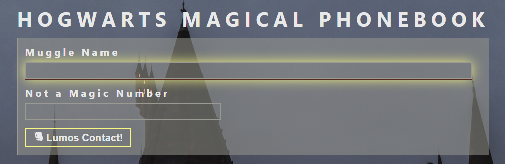
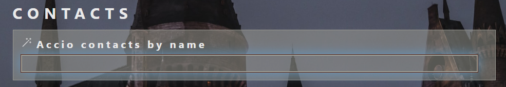
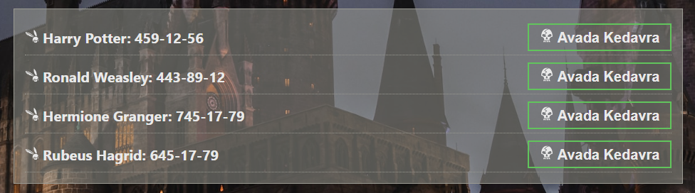
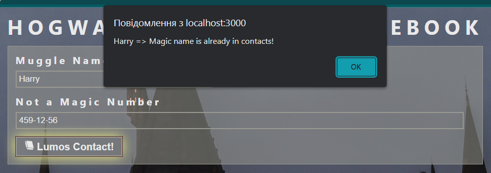
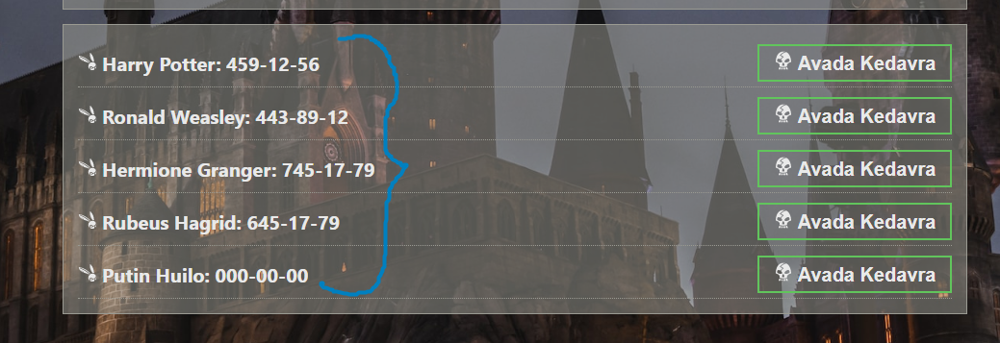
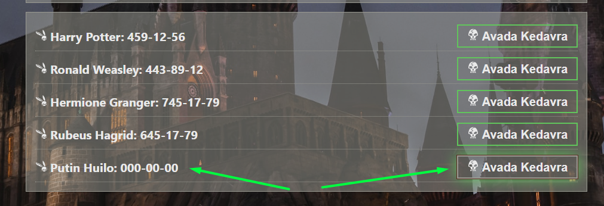

# React Homework - 6 - PhoneBook

To your attention, an application for saving phone numbers - Hogwarts Magical Phonebook.

## The project used:

`«React»`
`«Redux»`
`«React Redux»`
`«@reduxjs/toolkit»`
`«Javascript»`
`«React Icons / library»`
`«Emotion / library»`
`«Formik / library»`
`«redux-persist / npm»`
`«prop-types / npm»`
`«yup / npm»`

Used assembly: [React project template](https://github.com/goitacademy/react-homework-template#readme)

## Project structure

✅ Block in which you can add a new contact to the phone book.

✅ Block in which you can search for a contact by his name.

✅ A list of all phonebook contacts.

✅ You cannot add users with the same name or phone number.

✅ After restarting the application, all contacts will remain in place!

✅ And you can also delete a contact using the magic button!
